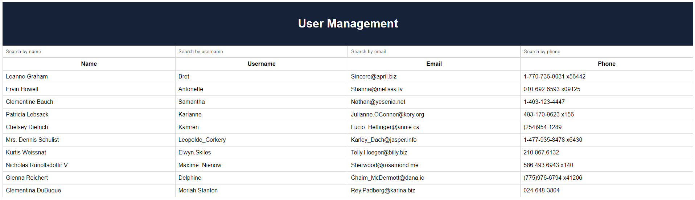
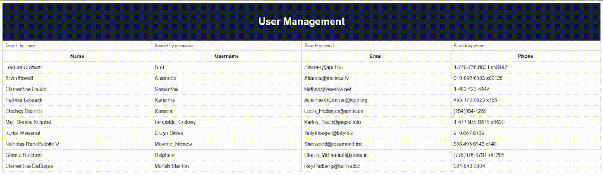
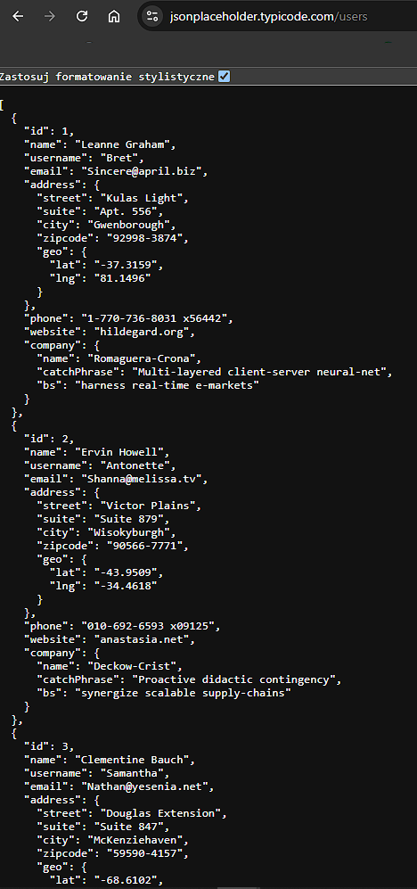

# Front-end developer assignment for SMART-buisness

## Main page

<p align="center">
  
  <br />
  <span>Main page view</span>
</p>

## Simple CSS

<p align="center">
  
  <br />
  <span>User filtering view</span>
</p>

## Fetch All Users (GET /users endpoint)

https://jsonplaceholder.typicode.com/users

<p align="center">
  
  <br />
  <span>users JSON view</span>
</p>

JSON example:

```json
{
    "id": 1,
    "name": "Leanne Graham",
    "username": "Bret",
    "email": "Sincere@april.biz",
    "address": {
      "street": "Kulas Light",
      "suite": "Apt. 556",
      "city": "Gwenborough",
      "zipcode": "92998-3874",
      "geo": {
        "lat": "-37.3159",
        "lng": "81.1496"
      }
    },
    "phone": "1-770-736-8031 x56442",
    "website": "hildegard.org",
    "company": {
      "name": "Romaguera-Crona",
      "catchPhrase": "Multi-layered client-server neural-net",
      "bs": "harness real-time e-markets"
    }
  },
```
